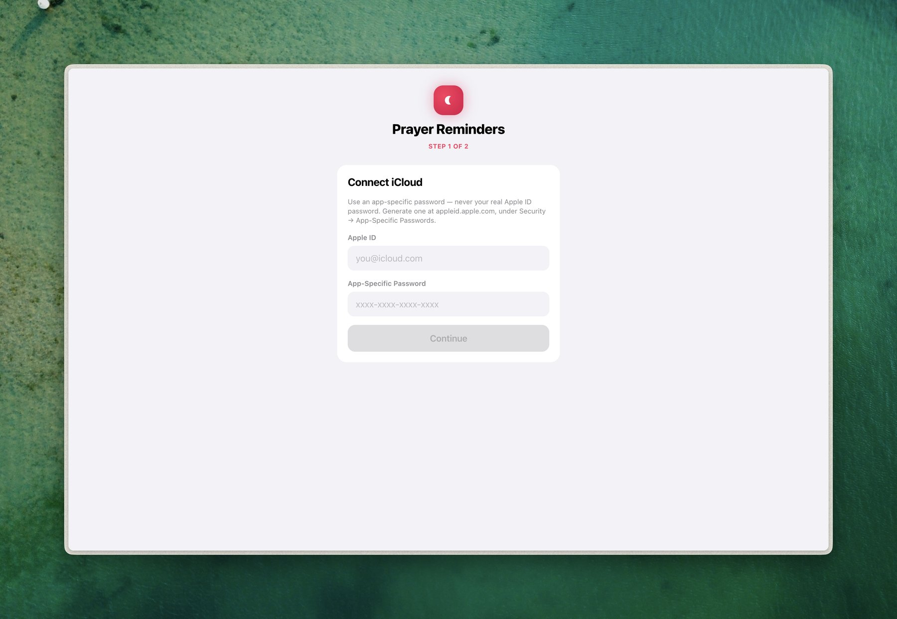
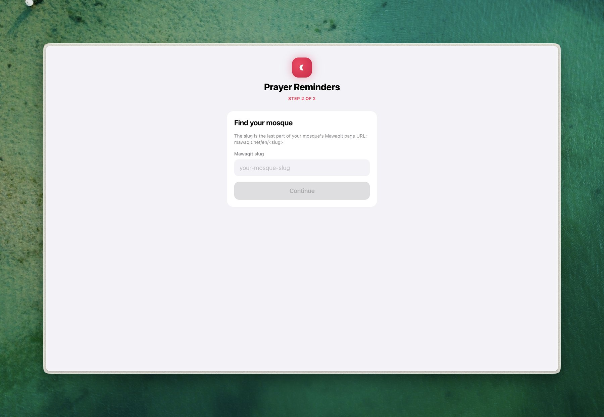
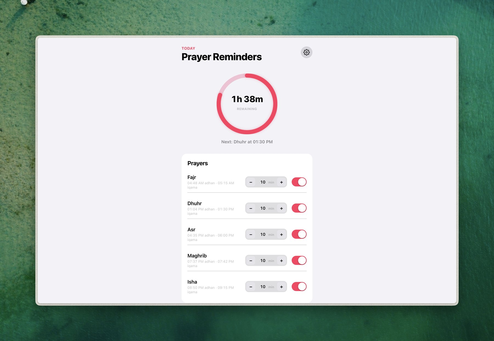

# Yaad e Khuda

A small tool that keeps your prayer times where you'll actually see them. It reads today's Iqama times off your mosque's Mawaqit page and writes them into a dedicated calendar on your iCloud account, your Google account, or both, as real events with real alarms. No extra app to check, no notification you have to remember exists. The reminder just shows up in the Calendar app you already look at.

The name means "remembrance of God." That's the whole point of the project, so it felt right.

## Screenshots

Onboarding, two steps, iCloud then mosque:

<p>
  
  
</p>

The Home dashboard, once you're set up, today's times, a countdown ring, and a toggle plus lead-time stepper per prayer:



## What it actually does

Every day, it fetches your mosque's page, pulls out today's Adhan and Iqama times, and syncs them into a calendar you own, iCloud, Google, or both at once, as events with native alarms/reminders attached. Because these are real events in a calendar you own (not a subscribed feed), the alarms actually fire. Both Apple and Google strip alarms from subscribed/shared calendars, so that approach was a dead end from the start.

The CLI is called `yaad`, installed as a console script. You can run it three ways depending on how much infrastructure you want around it.

- **Docker Compose** (recommended if you want this running unattended for a while). Two containers, a FastAPI backend and a Caddy served Svelte frontend, brought up with one command.
- **The web app directly** (`yaad serve`). Same backend and frontend, no containers. Good for local development or a quick trial.
- **Bare CLI plus cron**. The original design. No server to keep running, just two commands on a schedule.

Pick whichever fits. All three end up doing the same sync.

## Setting it up with Docker Compose

1. Create the directory that holds your config and state across container rebuilds.

   ```sh
   mkdir -p data
   ```

   If you already have a `config.yaml` from an earlier non-Docker setup, copy it in with `cp config.yaml data/config.yaml && chmod 600 data/config.yaml`. Otherwise the onboarding wizard will create one for you the first time you open the app.

2. Build and start both containers.

   ```sh
   docker compose up -d --build
   ```

   Open `http://localhost:8180` in a browser, that's the app. The backend also answers directly at `http://localhost:8100` if you ever want to hit the API without going through the frontend.

   The first visit walks you through onboarding, described below. As long as the `backend` container is running, the daily sync fires on its own. `restart: unless-stopped` keeps it up across reboots.

3. Watching what it's doing:

   ```sh
   docker compose logs -f backend    # scheduler activity, fetch/sync results, API access log
   docker compose logs -f frontend   # Caddy access log
   ```

4. Ports `8100` and `8180` were just free on the machine this was built on. Change the host side of the `ports` mappings in `docker-compose.yml` if either one collides with something you already have running.

Under the hood, the frontend container is Caddy serving the built Svelte files and reverse proxying `/api/*` to the backend by its Compose service name. That mirrors how the Vite dev server proxy works locally, so the browser only ever talks to one origin either way.

## Running it directly, no containers

1. Set up a virtual environment and install the backend.

   ```sh
   python3 -m venv .venv
   .venv/bin/pip install -e .
   ```

   This registers the `yaad` command inside the venv. Either activate the venv (`source .venv/bin/activate`) or call it by its full path.

2. Build the frontend once.

   ```sh
   cd frontend
   npm install
   npm run build     # writes to frontend/dist, served by the backend
   cd ..
   ```

3. Start the server.

   ```sh
   yaad serve
   ```

   This binds to `127.0.0.1:8000` by default. If you want it reachable elsewhere, or on a different port, pass `--host` and `--port` directly to the command, no config file needed for this part:

   ```sh
   yaad serve --host 0.0.0.0 --port 9000
   ```

   Open `http://127.0.0.1:8000` (or whatever host and port you chose). The first run walks you through connecting a calendar, then your mosque:

   - **Calendar.** Connect iCloud, Google, or both, whatever you check off here gets synced every run. For iCloud, an app specific password. Never your real Apple ID password, generate one at appleid.apple.com under Security, App-Specific Passwords. It gets checked against iCloud before anything is saved. For Google, see "Connecting Google Calendar" below, it needs a one-time Google Cloud Console setup before you can click Connect.
   - **Mosque.** Your mosque's Mawaqit slug, the last part of its page URL (`https://mawaqit.net/en/<slug>`). This gets checked by actually fetching the page, so you'll see today's real times right away.

   From there you land on Home, showing today's times, a toggle and minutes-before stepper for each prayer, and a card showing sync status.

   The `127.0.0.1` default exists because the server holds credentials for whichever calendar(s) you connect and isn't meant to be reachable from outside the machine, so only override it (as shown above) when you actually mean to expose it (Docker Compose already does this for you, binding `0.0.0.0` inside the container and mapping a host port instead).

   If calendar creation fails against iCloud (their CalDAV server has a history of `MKCALENDAR` quirks, see `caldav_sync.get_or_create_calendar`), the error message will tell you what to do. Create a calendar with the exact name from your config once, by hand, in the Calendar app or at icloud.com/calendar. Everything after that just finds it by name.

### Connecting Google Calendar

Google's Calendar API needs an OAuth2 client, there's no app-specific-password shortcut like iCloud's. One-time setup, done once per person running this:

1. Create a project at console.cloud.google.com (or reuse one), then enable the **Google Calendar API** under APIs & Services.
2. Under APIs & Services -> Credentials, create an **OAuth client ID** of type **Web application**.
3. Add an **Authorized redirect URI** matching however you're running the app, plus `/api/google/oauth/callback`. For example `http://localhost:8000/api/google/oauth/callback` (bare `yaad serve`), `http://localhost:8180/api/google/oauth/callback` (Docker Compose), or your real HTTPS domain if you're behind a reverse proxy. You can register more than one URI on the same client if you use this in more than one way.
4. Copy the **Client ID** and **Client Secret** into the app, either the Google card during onboarding or Settings later, then click **Connect Google Calendar**. You'll land on Google's consent screen, approve it, and you're redirected straight back into the app, connected.

The app derives its own redirect URI from whatever address you're visiting it at, so it works whether you're on localhost, Docker Compose, or a domain, as long as that exact URI is registered on the OAuth client in step 3.

4. As long as `yaad serve` keeps running, it fetches and syncs itself once a day, at whatever time you set on the Settings page's Schedule card (03:00 by default, editable without restarting). Keep the server running for this to happen without you. See "Running it persistently" below.

## Using the app

Once you're set up, opening the app takes you to Home.

- The ring at the top counts down to the next enabled prayer's Iqama, with "Next: {Prayer} at {time}" underneath. Before the day's first enabled prayer, or after the last one, it shows a resting state rather than a countdown. It doesn't peek ahead to tomorrow.
- The Prayers card lists each prayer's actual Adhan and Iqama time for today (read only, computed live from Mawaqit), a stepper for how many minutes before Iqama the alarm should fire (type into it directly or use the plus/minus buttons), and a toggle to turn that prayer on or off entirely. Both autosave a moment after you change them; watch for the small "Saving…" or "Saved" label. Turning a prayer off doesn't just stop future syncing: the next sync actively removes its event from the calendar if one was already sitting there.
- The Sync card shows when the daily job last ran, and whether it worked (with the error message if it didn't). Sync Now triggers a fetch and sync right away, outside the daily schedule.
- The gear icon in the top right opens Settings.
  - Appearance has a light mode toggle. It follows your system preference the first time, then remembers whatever you pick, stored in your browser rather than in `config.yaml` since it's a display preference, not a server one.
  - The Mosque, iCloud, and Schedule cards each need an explicit Save (unlike the Prayers card), because saving re-checks against Mawaqit or iCloud first. On the iCloud card, leave the password field blank to keep the one already saved, only fill it in when you're actually rotating it.
  - The back arrow returns you to Home.

The app is a PWA, so it's installable, "Add to Home Screen" on iOS/Android, the install icon in Chrome/Edge on desktop, and then launches standalone without browser chrome. That relies on a service worker, and browsers only register those over HTTPS (or `localhost`), so install won't be offered while you're serving this over plain `http://` on your LAN, which is what Caddy does out of the box in the Docker Compose setup. Put Caddy behind TLS (a reverse proxy with a real cert, or something like Tailscale/Cloudflare Tunnel) if you want the install prompt to show up there. Everything else about the app works identically either way, this only affects that one step.

### Running it persistently

If you're not using Docker Compose (which already restarts itself), `yaad serve` needs to stay running for the daily sync to fire. A simple systemd user service does the job.

```ini
# ~/.config/systemd/user/prayer-sync.service
[Unit]
Description=Prayer Reminder Sync

[Service]
WorkingDirectory=/path/to/prayer-time-sync
ExecStart=/path/to/prayer-time-sync/.venv/bin/yaad serve
Restart=on-failure

[Install]
WantedBy=default.target
```

```sh
systemctl --user daemon-reload
systemctl --user enable --now prayer-sync
journalctl --user -u prayer-sync -f   # logs, including each day's outcome
```

Drop `--user` and adjust the paths if you'd rather it start as a system-wide service, without needing a login session.

### Frontend development

```sh
cd frontend && npm run dev   # Vite dev server on :5173, proxies /api to :8000
yaad serve                    # backend on :8000, in another terminal
```

## Bare CLI plus cron, no server to keep running

Skip npm, `serve`, and Docker entirely and drive it by hand or via cron instead.

1. Follow the venv step above (`pip install -e .`).
2. Get your mosque slug and iCloud app-specific password as described above.
3. Create your config.

   ```sh
   cp config.example.yaml config.yaml
   chmod 600 config.yaml
   ```

   Edit it directly: mosque slug, iCloud credentials and calendar name, and each prayer's `enabled` and `minutes_before`. The `schedule` section doesn't matter here; it's only read by `serve`. Google Calendar's `refresh_token` can only be filled in through the OAuth flow in the web UI, so if you want Google alongside (or instead of) iCloud on a cron-driven setup, run `yaad serve` once, connect Google Calendar from Settings, then go back to cron; `client_id`/`client_secret`/`refresh_token` all live in `config.yaml` either way.

4. Run it once by hand to make sure it works end to end.

   ```sh
   yaad fetch
   yaad sync
   ```

   Check your iCloud calendar (the app, or icloud.com) for the new events.

5. Add it to crontab (`crontab -e`), early enough to run well before Fajr in your mosque's timezone.

   ```cron
   15 3 * * * cd /path/to/prayer-time-sync && \
     .venv/bin/yaad fetch >> logs/fetch.log 2>&1 && \
     .venv/bin/yaad sync  >> logs/sync.log  2>&1
   ```

   The `&&` matters: `sync` only runs if `fetch` succeeded, so a failed fetch never gets papered over by a sync running on stale data. Cron mails stderr on failure by default, and the log redirects give you a persistent trail to check besides.

## Running the tests

```sh
.venv/bin/pip install -r requirements-dev.txt
.venv/bin/python -m pytest
```

The suite runs fully offline: mosque page parsing is tested against a fixture in `tests/fixtures/`, the CalDAV upsert and delete logic against an in-memory fake calendar, and the FastAPI routes through `TestClient` with the mawaqit and CalDAV calls monkeypatched. No live iCloud account or network needed. There's no automated frontend suite (a personal UI is usually fastest to check by just looking at it); the acceptance criteria in `docs/idea.md` §6 are meant to be walked through by hand, once, against your real account.

## Project layout

```
Dockerfile.backend      # backend image, pip install ., `yaad serve` as entrypoint
docker-compose.yml       # backend (port 8100) + frontend (port 8180) services

src/prayer_sync/
├── config.py        # load_config() -- re-read fresh every run; onboarding's partial-write helpers
├── mawaqit.py        # fetch mosque page, extract confData, compute today's adhan/iqama
├── state.py          # local JSON state: today's computed times (atomic write)
├── caldav_sync.py     # iCloud CalDAV: find/create calendar, upsert/delete events
├── google_calendar_sync.py  # Google Calendar API: OAuth, find/create calendar, upsert/delete events
├── service.py        # fetch/sync business logic shared by the CLI, API, and scheduler
├── scheduler.py       # in-process daily scheduler (APScheduler) started by `serve`
├── api.py            # FastAPI app: onboarding, settings, live prayer times, sync status/trigger
└── cli.py            # `yaad fetch` / `sync` / `serve` -- registered via pyproject.toml's [project.scripts]

frontend/
├── Dockerfile             # multi-stage: npm build -> Caddy serving frontend/dist
├── Caddyfile              # reverse-proxies /api/* to the backend container; SPA fallback otherwise
├── src/App.svelte         # routes to Onboarding or Settings(Home/Settings pages) based on /api/setup/status
└── src/lib/
    ├── api.js                     # fetch wrappers for the backend
    ├── theme.css, theme.js        # design tokens (true-black canvas, Move-pink accent) + light/dark toggle
    ├── components/                # Card, Button, Toggle, Stepper, TextField, Toast, NextPrayerRing
    ├── onboarding/                 # 2-step wizard: connect calendar(s) (iCloud and/or Google), then mosque
    └── settings/                  # Settings.svelte (shell) -> HomePage.svelte / SettingsPage.svelte
```
